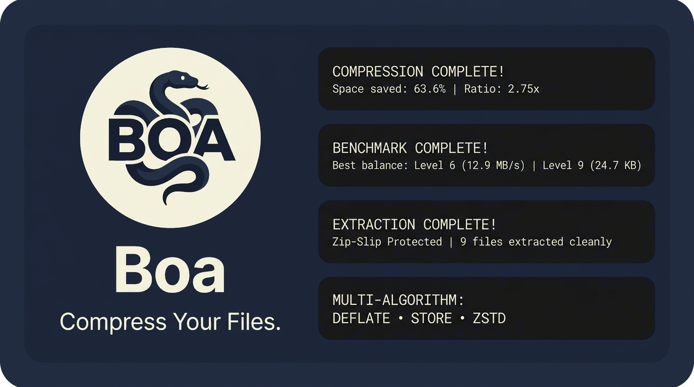

<div align="center">


<br/><br/>

# 🐍 Boa

**Tight, fast, lossless compression and archiving for your files. Free open-source CLI.**

[](https://go.dev)
[](./LICENSE)
[](./README.md)
[](./SECURITY_AUDIT.md)

</div>

<br/>

<div align="center">
  
</div>

<br/>

---

## ✨ Features

- 🗜️ **All-in-One CLI Toolkit**: Combines fast zip compression, safe extraction, in-place header inspection, live speed benchmarking, and an interactive terminal file explorer in a single zero-dependency binary.
- 🏎️ **Streaming I/O Engine**: Low memory footprint during both compression and extraction with direct chunked streams. Compresses multi-gigabyte folders without eating your RAM.
- 🛡️ **Zip-Slip & Path Security**: Built-in canonical path boundary validation that prevents malicious directory traversals (`../../`), null-byte injections, and escaping symlinks.
- 🎚️ **Granular Compression Tuning**: Supports compression levels `0` (Store), `1` (Fastest speed), `6` (Default), up to `9` (Maximum Deflate).
- 📁 **Interactive Terminal File Explorer**: Browse folders and zip files directly from your terminal using arrow keys (`↑↓`) without typing long paths manually.
- 📊 **Dense Terminal UI**: Stable column alignment, single-screen summaries, ANSI color palette with automatic `NO_COLOR` support, and human-friendly space translations (*"That's like ~19 4K movies worth of space!"*).
- 🪟 **True Cross-Platform**: Native builds and path normalization for macOS (Apple Silicon & Intel), Linux (x86_64 & ARM), and Windows.

---

## 🚀 Quick Start

Boa requires no external runtime dependencies.

### Install via Makefile (Recommended for macOS / Linux)

```bash
git clone https://github.com/zyadwael/boa.git
cd boa
make install
# Installs 'boa', 'bo', and 'compressor' aliases to ~/.local/bin
```

### Install via Go

```bash
go install github.com/zyadwael/boa@latest
```

---

## ⚡ Run

```bash
bo                      # Interactive arrow-key main menu & file explorer
bo pack <path>          # Compress folder or files into a zip archive
bo unpack <archive.zip> # Safely extract zip archive into directory
bo list <archive.zip>   # Inspect contents, sizes, CRC32, and compression ratios
bo bench <path>         # Benchmark throughput speeds (MB/s) across levels (0-9)
bo version              # Show version, commit SHA, and platform info
bo --help               # Show help reference
```

### Preview Safely

```bash
bo pack ./my-folder --dry-run          # Preview files to pack and estimated size
bo unpack archive.zip --dry-run        # Preview extraction paths safely
bo pack ./my-folder -e "node_modules"  # Exclude patterns (*.tmp, .git*, node_modules)
bo pack ./my-folder -l 9               # Use maximum compression level
bo unpack archive.zip -o ./dist -f     # Overwrite destination files with --force
bo list archive.zip --json             # Export structured JSON metadata
```

---

## 🛡️ Safety

Boa can modify and create archive files, so it validates paths, enforces extraction boundaries, and asks for confirmation when overwriting existing files.

- **Zip-Slip Defense**: All entry paths in incoming archives are sanitized with canonical prefix checks. Any entry with `../`, leading slashes (`/`), or drive roots (`C:\`) is blocked with an explicit security error before disk access.
- **Symlink Boundary Checks**: Symlinks pointing outside the extraction boundary are prevented from executing.
- **Atomic Operations**: Compression writes to temporary files first (`.compressor_tmp_*.zip`) before atomically moving the finished archive into place.
- **Same-Directory Defaults**: Compressed files are automatically saved directly in the same parent directory as the target source.
- Review [SECURITY.md](./SECURITY.md) and [SECURITY_AUDIT.md](./SECURITY_AUDIT.md) for full threat matrix evaluations and verification benchmarks.

---

## 🔍 Features in Detail

### 1. Interactive Main Menu & File Picker
Typing `bo` in your terminal launches the real-time interactive dashboard with live arrow-key (`↑↓` / `jk`) navigation:

```text
 ____                 
| __ )  ___   __ _    
|  _ \ / _ \ / _` |   
| |_) | (_) | (_| |   https://github.com/zyadwael/boa
|____/ \___/ \__,_|   Tight, fast, lossless compression for your files.

Update 1.0.0 available, run bo update

   1. Pack        Compress folders into dense archives
   2. Unpack      Safely extract zip archives
   3. Inspect     Explore archive structure & metadata
   4. Benchmark   Compare compression speed & ratios
 ➤ 5. Status      Runtime health & system info

 ↑↓ / jk Navigate  |  Enter Confirm  |  1-5 Jump  |  V Version  |  Q Quit
```

Selecting **Pack** or **Unpack** opens the in-terminal **File Explorer**:

```text
▶ Select Folder or File to Compress
Location: /Users/zyadwael/Go/compressor

➤ ✔  [SELECT THIS CURRENT FOLDER: compressor]
  📁  .. (Parent Directory)
  📁  cmd/
  📁  docs/
  📁  internal/
  📁  pkg/
  📄  Makefile
  📄  README.md
  📄  main.go

========================================================================
 ↑↓ Navigate  |  Enter Open/Select  |  S Select Current Folder  |  Q Cancel
```

---

### 2. Pack (Compression)
`bo pack` streams and compresses files and directories with customizable levels:

```text
$ bo pack ./cmd -l 6

========================================================================
 COMPRESSION COMPLETE!
 📍 Saved To: /Users/zyadwael/Go/compressor/cmd.zip
 Space saved: 6.3 KB | Compression ratio: 1.85x (46.1% saved) | Speed: 14.2 MB/s
 That's like ~128 text documents worth of space!
 Files packed: 7 (avg file size: 1.9 KB) | Categories: 1 folders | Time: 2ms
========================================================================
```

---

### 3. Unpack (Decompression)
`bo unpack` safely extracts files with path verification:

```text
$ bo unpack ./cmd.zip -o ./extracted --force

========================================================================
 EXTRACTION COMPLETE!
 📍 Extracted To: ./extracted
 Total unpacked: 13.7 KB | Speed: 12.3 MB/s | Time: 1ms
 Extracted 7 files (avg file size: 1.9 KB) into destination.
========================================================================
```

---

### 4. Inspect (List Archive)
`bo list` displays a dense tabular breakdown of archive entries without extracting:

```text
$ bo list ./cmd.zip

Type  Permissions  Original  Packed  Ratio  Modified Date     Path           
────  ───────────  ────────  ──────  ─────  ────────────────  ───────────────
DIR   drwxr-xr-x          -       -      -  2026-09-27 13:11  cmd/           
FILE  -rw-r--r--     2.4 KB  1.1 KB    55%  2026-09-27 13:08  cmd/bench.go   
FILE  -rw-r--r--     1.6 KB   618 B    63%  2026-09-27 13:11  cmd/cmd_test.go
FILE  -rw-r--r--     1.1 KB   647 B    43%  2026-09-27 13:08  cmd/list.go    
FILE  -rw-r--r--     2.8 KB  1.3 KB    55%  2026-09-27 13:08  cmd/pack.go    
FILE  -rw-r--r--     2.2 KB  1.1 KB    50%  2026-09-27 13:07  cmd/root.go    
FILE  -rw-r--r--     2.6 KB  1.2 KB    54%  2026-09-27 13:08  cmd/unpack.go  
FILE  -rw-r--r--      946 B   479 B    49%  2026-09-27 13:08  cmd/version.go 
========================================================================
 📍 Archive: /Users/zyadwael/Go/compressor/cmd.zip
 Total: 7 files (avg size: 1.9 KB), 1 folders | Raw: 13.7 KB | Packed: 7.4 KB | Ratio: 1.85x (46.1% saved)
========================================================================
```

---

### 5. Benchmark (Speed vs Ratio)
`bo bench` evaluates compression levels 0, 1, 6, and 9 side-by-side with throughput metrics:

```text
$ bo bench ./cmd

▶ Benchmarking Compression Levels on: ./cmd

Level        Original Size  Packed Size  Saved   Time      Speed
───────────  ─────────────  ───────────  ─────  ─────  ─────────
0 (Store)          13.7 KB      14.7 KB  -7.6%  661µs  20.2 MB/s
1 (Fastest)        13.7 KB       7.9 KB  42.2%    1ms  10.3 MB/s
6 (Default)        13.7 KB       7.4 KB  46.1%    1ms  10.6 MB/s
9 (Best)           13.7 KB       7.3 KB  46.5%    1ms  10.2 MB/s
```

---

### 6. JSON Export
`bo list --json archive.zip` returns structured metadata for scripting:

```json
{
  "total_files": 7,
  "total_dirs": 1,
  "uncompressed_bytes": 14032,
  "compressed_bytes": 7578,
  "average_file_size": 2004,
  "compression_ratio": 0.54,
  "space_saved_bytes": 6454,
  "space_saved_percent": 46.1,
  "archive_path": "cmd.zip"
}
```

---

## 📄 License

Boa is free open source software released under the **MIT License**. See [LICENSE](./LICENSE) for details.
