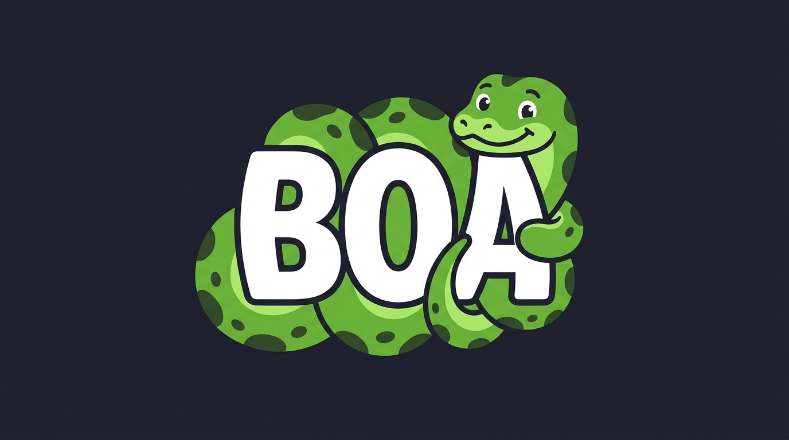
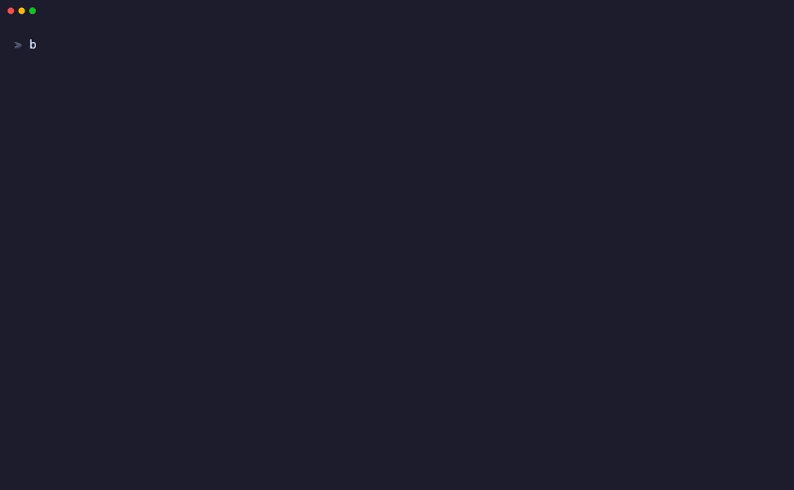

<div align="center">



<br/><br/>

# Boa

[](https://go.dev)
[](./LICENSE)
[](./README.md)
[](./SECURITY_AUDIT.md)
[](https://x.com/Zyadwaelll05)
[](https://www.linkedin.com/in/zyad-wael-a9035a275/)

</div>

<br/>

> Tight, fast, and interactive compression engine for your terminal. Compresses folders, extracts archives, inspects metadata, benchmarks performance, and navigates your filesystem without leaving the command line.

<br/>

---

## Features

- **Multi-Algorithm & Media Engine**: Supports standard **DEFLATE** (levels 1–9), raw **Store** (level 0), modern **Zstandard (`zstd`)**, and perceptual optimization for **Images, Audio, and Video** with configurable quality and bitrate.
- **Fail-Closed Safety Policy**: Code, documents, text, databases, archives, executables, and unknown files are **always 100% lossless**. Lossy compression requires verified media magic bytes and explicit consent.
- **Bubble Tea Terminal Interface**: Fullscreen Elm-architecture TUI (`bo`) with interactive file explorer, multi-step media wizard, live size estimation ranges, and contextual technique modals.
- **Educational Knowledge Base (`bo learn`)**: Embedded reference explaining algorithm mechanics, tradeoffs, analogies, gains, and losses.
- **All-in-One CLI Toolkit**: Combines fast compression, safe extraction, in-place header inspection, live multi-level benchmarking, and a full terminal file explorer in a single binary.
- **Streaming I/O Engine**: Low memory footprint during both compression and extraction with direct chunked streams.
- **Zip-Slip & Path Security**: Built-in canonical path boundary validation that blocks directory traversals (`../../`), null-byte injections, and escaping symlinks before writing to disk.
- **Dynamic Best Balance Benchmarking**: Automatically computes the real mathematical efficiency knee-point balancing space savings ($65\%$) against throughput ($35\%$) with side-by-side comparison charts.
- **Cross-Platform Parity**: Native builds and path normalization for macOS (Apple Silicon & Intel), Linux (x86_64 & ARM), and Windows.

---

## Why Boa?

Most command-line compression utilities force users to memorize arcane flags across separate tools or risk silent quality loss on mixed directories.

Boa delivers a **modern, safe, media-aware terminal archive experience**:
- **Interactive Bubble Tea TUI**: Navigate files, configure media presets, adjust visual quality sliders, and preview estimated archive sizes in real time.
- **Media-Aware Optimization**: Automatically compress JPEG/PNG images, transcode audio (AAC/Opus/MP3), and scale videos while keeping all source code and documents bit-for-bit identical.
- **Educational Guide**: Understand *why* and *how* compression techniques work directly in your terminal with `bo learn`.
- **Multi-Engine Support**: Choose between DEFLATE (default), Store (no compression), and Zstandard (`zstd`) with `-m / --method`.
- **Secure by Default**: Automatically blocks Zip-Slip directory traversal attacks (`../../`) and malicious symlink escapes.
- **Instant Benchmarking**: Compare compression speeds and ratios across levels (0 to 9) and algorithms with dynamic efficiency rankings.

<br/>

<div align="center">
  
</div>

<br/>

```text
 ____                 
| __ )  ___   __ _    
|  _ \ / _ \ / _` |   https://github.com/ZyadWKhedr/Boa
| |_) | (_) | (_| |   Tight, fast, lossless compression for your files.
|____/ \___/ \__,_|   Version v0.3.1  ·  Interactive compression toolkit

➤ 1.  Compress         Package files into a zip archive with smart media options
  2.  Extract          Safely unzip archives with Zip-Slip path defense
  3.  Browse Archive   Inspect files, sizes, ratios & lossy metadata
  4.  Learn            Educational guide: how compression algorithms work
  5.  More...          Benchmarks, level comparison, system status & tools

↑↓/jk Navigate  ·  Enter Select  ·  1-5 Jump  ·  ? Learn  ·  q Quit
```

<br/>

---

## Quick Start

Boa supports macOS (Apple Silicon & Intel), Linux (x86_64 & ARM), and Windows.

### Install via Script (macOS / Linux)

```bash
curl -fsSL https://raw.githubusercontent.com/ZyadWKhedr/Boa/main/install.sh | bash
```

The script installs into `~/.local/bin` (or `/usr/local/bin` if run as root) and creates symlinks for `boa`, `bo`, and `compressor`.

### Install into a User-Owned Directory (Password-Free)

```bash
mkdir -p "$HOME/.local/bin"
curl -fsSL https://raw.githubusercontent.com/ZyadWKhedr/Boa/main/install.sh | bash
export PATH="$HOME/.local/bin:$PATH"
```

Add `export PATH="$HOME/.local/bin:$PATH"` to your `~/.zshrc` or `~/.bashrc` for new terminals.

### Install via Go

```bash
go install github.com/ZyadWKhedr/Boa@latest
```

### Install a Specific Release Version

To install a specific release version (e.g. `v0.3.1`):

```bash
curl -fsSL https://raw.githubusercontent.com/ZyadWKhedr/Boa/main/install.sh | bash -s -- v0.3.1
```

### Build from Source

```bash
git clone https://github.com/ZyadWKhedr/Boa.git
cd Boa
make install
```

---

## Run

```bash
bo                         # Interactive dashboard & fullscreen file explorer
bo compress <path>         # Compress folder or file (DEFLATE level 6 default)
bo compress <path> -m zstd # Compress using modern Zstandard (Method 93)
bo compress <path> -m store# Package raw files without compression
bo extract <archive.zip>   # Safely extract zip archive into directory
bo list <archive.zip>      # Inspect contents, file sizes, and compression ratios
bo bench <path>            # Benchmark throughput speeds (MB/s) across levels (0-9)
bo version                 # Show version, commit SHA, and platform info
bo uninstall               # Safely remove Boa binaries and symlinks from system
bo --help                  # Show help reference
```

### Preview Safely

```bash
bo compress ./my-folder --dry-run          # Preview files to compress and estimated size
bo compress ./my-folder -m zstd -l 3       # Zstandard compression with custom level
bo compress ./my-folder -e "node_modules"  # Exclude patterns (*.tmp, .git*, node_modules)
bo compress ./my-folder -l 9               # Use maximum DEFLATE compression level
bo extract archive.zip -o ./dist -f        # Overwrite destination files with --force
bo list archive.zip --all                  # Display complete file list without truncation
bo list archive.zip --json                 # Export structured JSON metadata
```

---

## Safety

Boa validates paths, enforces extraction boundaries, and asks for confirmation when overwriting existing files.

- **Zip-Slip Defense**: All entry paths in incoming archives are sanitized with canonical prefix checks. Any entry containing `../`, leading slashes (`/`), or drive roots (`C:\`) is blocked with an explicit security error before disk access.
- **Symlink Boundary Checks**: Symlinks pointing outside the extraction boundary are prevented from executing.
- **Atomic Operations**: Compression writes to temporary files first (`.compressor_tmp_*.zip`) before atomically moving the finished archive into place.
- **Same-Directory Defaults**: Compressed files are automatically saved directly in the same parent directory as the target source.
- Review [SECURITY.md](./SECURITY.md) and [SECURITY_AUDIT.md](./SECURITY_AUDIT.md) for full threat matrix evaluations and verification benchmarks.

---

## Features in Detail

### 1. Interactive Bubble Tea Dashboard & Multi-Media Wizard
Typing `bo` in your terminal launches the fullscreen interactive dashboard built with [Charm Bubble Tea](https://github.com/charmbracelet/bubbletea) and [Lip Gloss](https://github.com/charmbracelet/lipgloss):

```text
 ____                 
| __ )  ___   __ _    
|  _ \ / _ \ / _` |   https://github.com/ZyadWKhedr/Boa
| |_) | (_) | (_| |   Tight, fast, lossless compression for your files.
|____/ \___/ \__,_|   Version v0.3.1  ·  Interactive compression toolkit

➤ 1.  Compress         Package files into a zip archive with smart media options
  2.  Extract          Safely unzip archives with Zip-Slip path defense
  3.  Browse Archive   Inspect files, sizes, ratios & lossy metadata
  4.  Learn            Educational guide: how compression algorithms work
  5.  More...          Benchmarks, level comparison, system status & tools

↑↓/jk Navigate  ·  Enter Select  ·  1-5 Jump  ·  ? Learn  ·  q Quit
```

#### In-Terminal File Explorer
Selecting **Compress** or **Extract** opens the interactive directory browser with instant folder navigation, directory breadcrumbs, formatted sizes, and file type indicators:

```text
 📁 Select Folder or File to Compress
 Current Directory: ~/Projects/media-gallery

 ➤ 📁  .. (parent directory)
   📁  audio/
   📁  documents/
   📁  photos/
   📁  videos/
   📄  Makefile (1.2 KB)
   📄  README.md (3.4 KB)
   📦  backup.zip (14.2 MB)

 ↑↓/jk Navigate  ·  →/l Open Dir  ·  Enter Select  ·  Space Current Dir  ·  Esc Cancel
```

#### Multi-Step Media Compression Wizard
When compressing directories containing photos, music, or videos, Boa launches a multi-step wizard:

```text
 🐍 Boa Compression Wizard (Step 2 of 4)
 ━━━━━━━━━━━━━━━━━━━━━━━━━━━━━━━━━━━━━━━━━━━━━━━━━━━━━━━━━━━━
 📸 Image Compression (24 files · 48.2 MB)
 Techniques: JPEG quality recompression, PNG palette reduction

 Mode:     [ Lossless ]  ▶ [ Lossy ] ◀
 Quality:  [████████████████░░░░]  80%  (←/→ to adjust)

 📊 Estimated Total Size: 18.5 MB ~ 24.1 MB (Saved: ~50% to ~62%)

 ℹ Tip: 80% retains crisp visual clarity for 99% of viewing contexts.
 Press '?' for in-depth educational guide on JPEG Quality.

 ────────────────────────────────────────────────────────────
 ↑↓ Switch Row  ·  ←→ Adjust  ·  ? Help  ·  Enter Next  ·  Esc Cancel
```

- **Live Estimated Range**: Recalculates projected savings dynamically as you adjust quality sliders.
- **Contextual Knowledge Modal**: Press `?` at any step to view real-time educational explanations of the active compression algorithm.
- **Explicit Consent**: If any lossy settings are selected, a dedicated confirmation screen details expected visual trade-offs before packing.

---

### 2. Media Compression Engine & Safety Policies

Boa features a content-aware compression engine designed with strict safety rules:

```text
┌────────────────────────────────────────────────────────────────────────┐
│                        CONTENT CLASSIFICATION                          │
│               (Magic Bytes & Container Probing)                        │
└──────────────────────────────────┬─────────────────────────────────────┘
                                   │
         ┌─────────────────────────┴─────────────────────────┐
         ▼                                                   ▼
┌──────────────────────────────────┐        ┌────────────────────────────┐
│   MEDIA FILES (Image/Audio/Vid)  │        │   ALL OTHER / UNKNOWN      │
│   JPEG, PNG, MP3, WAV, MP4...    │        │   Code, Text, Docs, DBs... │
└────────────────┬─────────────────┘        └─────────────┬──────────────┘
                 │                                        │
        [Policy Check #1 & #2]                            │
                 │                                        │
        Lossy Permitted?                                  │
         ├── YES (with explicit consent)                  │
         │   └── JPEG Quality / PNG Palette               │
         │       Audio Bitrate / Video CRF                │
         │                                                │
         └── NO (Default) ────────────────────────────────┼─────────────────┐
                                                          ▼                 ▼
                                                   [100% LOSSLESS]   [100% LOSSLESS]
                                                   DEFLATE (1-9)      Zstandard / Store
```

- **Fail-Closed Safety Policy**: Non-media files (source code, text, documents, databases, executables) are **never** subjected to lossy compression under any circumstance.
- **Content-First Magic Byte Probing**: Inspects file headers to defeat deceptive file extensions (e.g. source code renamed to `.jpg`).
- **Source File Integrity**: Original source files on disk are never altered; output archives are created via atomic staging streams.
- **ZIP Lossy Comment Tracking**: Archives containing lossy files are stamped with `Boa-Lossy: ...` comment headers, rendering clear badges in `bo list` while remaining 100% compatible with standard OS unzipping utilities.

#### CLI Media Compression Flags
```bash
# Compress with lossy image optimization at 75% quality
bo compress ./media -o ./output.zip --lossy images --quality 75

# Transcode images and audio, and strip non-essential metadata
bo compress ./media -o ./output.zip --lossy images,audio --quality 80 --strip-metadata

# Target specific audio and video compression
bo compress ./media -o ./output.zip --lossy video --quality 65
```

---

### 3. Educational Knowledge Base (`bo learn`)
Boa embeds a comprehensive compression knowledge base directly into the binary:

```bash
bo learn                # List all lossless and lossy techniques
bo learn jpeg-quality   # Learn how DCT quantization and chroma subsampling work
bo learn deflate        # Learn LZ77 sliding window and Huffman entropy coding
bo learn opt-png        # Learn Deflate line filtering and palette quantization
```

Example explanation output:
```text
 [LEARN] JPEG Quality Compression
 Summary: Perceptual frequency reduction via discrete cosine transform (DCT) and quantization.

 💡 Analogy: Like drawing a portrait with high detail on faces, while slightly smoothing out background leaves that human eyes barely notice.

 ✔ Gain: 40% to 75% file size reduction with virtually invisible visual degradation at 75-85%.
 ✖ Loss: Irreversible loss of raw sensor data and fine high-frequency noise.

 🎯 Best: Photos, web graphics, digital camera scans, social media distribution.
 ⚠️ Avoid: Line art, logos, text screenshots, graphics with sharp contrasting edges, master photo archives.
```

---

### 4. Compress (Packaging)
`bo compress` streams and compresses files and directories with customizable levels:

```text
$ bo compress ./cmd -l 6

 ✔ Compression Complete

   Archive          ~/Desktop/cmd.zip
   Original Size    28.5 KB
   Compressed       12.5 KB
   Space Saved      16.1 KB (56.3% reduction)
   Ratio            2.29x
   Method / Level   Deflate (Level 6 · Default)
   Speed            15.5 MB/s
   Packed Items     9 files (avg 3.2 KB), 1 folders
   Duration         2ms
```

---

### 5. Extract (Decompression)
`bo extract` extracts files safely with path verification:

```text
$ bo extract ./cmd.zip -o ./extracted --force

 ✔ Extraction Complete

   Source Archive   ~/Desktop/cmd.zip
   Extracted To     ~/Desktop/extracted
   Total Size       28.5 KB
   Items            9 files (avg 3.2 KB), 1 folders
   Speed            14.2 MB/s
   Duration         1ms
```

---

### 4. Inspect (List Archive)
`bo list` displays a dense tabular breakdown of archive entries without extracting:

```text
$ bo list ./cmd.zip

Type  Permissions  Original  Packed  Ratio  Modified Date     Path           
────  ───────────  ────────  ──────  ─────  ────────────────  ──────────────────
DIR   drwxr-xr-x          -       -      -  2026-09-27 13:43  cmd/           
FILE  -rw-r--r--     3.6 KB  1.5 KB    58%  2026-09-27 15:13  cmd/bench.go   
FILE  -rw-r--r--     1.6 KB   618 B    63%  2026-09-27 13:11  cmd/cmd_test.go
FILE  -rw-r--r--     5.3 KB  2.0 KB    63%  2026-09-27 15:03  cmd/filepicker.go
FILE  -rw-r--r--     8.5 KB  2.5 KB    71%  2026-09-27 15:02  cmd/interactive.go
FILE  -rw-r--r--     1.1 KB   647 B    43%  2026-09-27 13:08  cmd/list.go    
FILE  -rw-r--r--     2.8 KB  1.3 KB    54%  2026-09-27 14:38  cmd/pack.go    
FILE  -rw-r--r--     2.3 KB  1.1 KB    53%  2026-09-27 13:26  cmd/root.go    
FILE  -rw-r--r--     2.4 KB  1.1 KB    53%  2026-09-27 14:39  cmd/unpack.go  
FILE  -rw-r--r--      946 B   479 B    49%  2026-09-27 13:08  cmd/version.go 

   Archive          ~/Desktop/cmd.zip
   Total Entries    9 files (avg 3.2 KB), 1 folders
   Original Size    28.5 KB
   Archive Size     12.5 KB
   Total Savings    2.29x (56.3% saved)
```

---

### 5. Benchmark (Speed vs Ratio & Trade-offs)
`bo bench` evaluates compression levels 0 through 9 side-by-side with real-time throughput metrics, ratio multipliers, duration, and trade-off analysis:

```text
$ bo bench ./internal

 Boa Compression Benchmark

 Input
 ────────────────────────────────────────────
   Path:          internal
   Files:         15
   Directories:   7
   Input size:    68.0 KB

 Results
 ──────────────────────────────────────────────────────────────
Level      Time     Size  Saved  Ratio      Speed
─────────  ────  ───────  ─────  ─────  ─────────
0 (store)   1ms  71.2 KB  -4.7%  0.95x  48.4 MB/s
1           3ms  27.8 KB  59.1%  2.45x  17.0 MB/s
2           3ms  27.3 KB  59.8%  2.49x  21.0 MB/s
3           4ms  26.7 KB  60.7%  2.55x  15.0 MB/s
4           3ms  25.9 KB  62.0%  2.63x  17.6 MB/s
5           4ms  25.3 KB  62.8%  2.69x  15.2 MB/s
6 ★         5ms  25.2 KB  63.0%  2.70x  12.9 MB/s
7           5ms  24.9 KB  63.4%  2.73x  12.9 MB/s
8           3ms  24.8 KB  63.5%  2.74x  18.3 MB/s
9           5ms  24.7 KB  63.6%  2.75x  11.7 MB/s

 Summary
 ────────────────────────────────────────────
   Fastest:         Level 0   • 48.4 MB/s
   Smallest:        Level 9   • 24.7 KB
   Best balance:    Level 6   • 12.9 MB/s / 25.2 KB

   • Level 6 compared with Level 1: +3.8% compression, -24.2% throughput
   • Levels 6–9 produced less than 1.0% difference in archive size (0.6% extra space saved at Level 9).
```

#### Why Compression Levels Behave Differently
- **Level 0 (Store)**: No LZ77 dictionary search or Huffman encoding; fastest I/O speed.
- **Level 1 (Fastest)**: Short match search depth with eager evaluations; high throughput for streaming pipelines.
- **Level 6 (Default)**: Balanced match evaluations providing ~95% of maximum compression with low CPU overhead.
- **Level 9 (Maximum)**: Deep chain searches with lazy match evaluation; best density for archival storage at the cost of additional CPU time.

#### Advanced Benchmark Options:
```bash
bo bench ./project --compare           # Visual ASCII bar charts for size & throughput
bo bench ./project --runs 3            # Average results over multiple iterations
bo bench ./project --level 6           # Benchmark a specific level only
bo bench ./project --decomp            # Also benchmark decompression duration & throughput
bo bench ./project --json              # Output structured JSON for CI/CD pipelines
bo bench ./project --csv               # Export tabular metrics to CSV
bo bench ./project --keep              # Preserve generated benchmark archives on disk
```

---

### 6. JSON Export
`bo list --json archive.zip` and `bo bench --json <folder>` return machine-readable output:

```json
{
  "title": "Boa Compression Benchmark",
  "input": {
    "path": "internal",
    "total_files": 15,
    "size_bytes": 69632,
    "size_human": "68.0 KB"
  },
  "results": [
    {
      "level": 6,
      "name": "6 (Default)",
      "method": "DEFLATE",
      "duration_ms": 5.2,
      "compressed_size": 25804,
      "ratio_multiplier": 2.70,
      "space_saved_percent": 63.0,
      "throughput_mbps": 12.9
    }
  ]
}
```

---

## Support & Community

If Boa helped you, give it a star on GitHub, [share it on X](https://twitter.com/intent/tweet?url=https://github.com/ZyadWKhedr/Boa&text=Boa%20-%20Tight%2C%20fast%2C%20lossless%20compression%20for%20your%20files.), or open an issue or pull request.

- **Author**: Zyad Wael
- **X (Twitter)**: [@Zyadwaelll05](https://x.com/Zyadwaelll05)
- **LinkedIn**: [Zyad Wael](https://www.linkedin.com/in/zyad-wael-a9035a275/)
- **Email**: [ziad.w.khedr@gmail.com](mailto:ziad.w.khedr@gmail.com)

---

## License

Boa is free open source software released under the **MIT License**. See [LICENSE](./LICENSE) for details.
